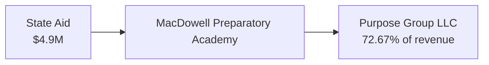
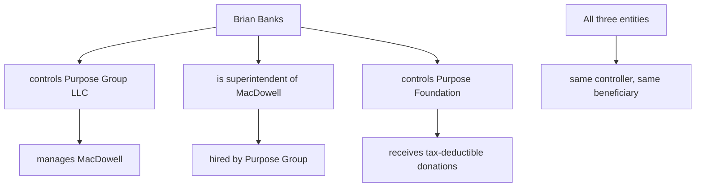

+++
title = "Where the Money Goes — MacDowell Funding Flow Analysis"
description = "MacDowell spends 32% on instruction vs. the 55-65% state target. Purpose Group LLC takes 10% management fee plus all operating costs — 72.67% of revenue."
weight = 6
date = 2026-09-26
updated = 2026-09-26

[extra]
keywords = "MacDowell Preparatory Academy funding, Purpose Group LLC management fee, Detroit charter school spending, charter school financial extraction, Michigan school funding allocation, MacDowell 32 percent instruction"

[taxonomies]
actors = ["Brian Banks", "Joseph Holland"]
entities = ["MacDowell Preparatory Academy", "The Purpose Group LLC", "Purpose Charter Academy", "Michigan Department of Education"]
connections = ["business entity", "financial audit", "charter authorization"]
+++

Michigan school funding follows a per-pupil model. State aid flows to the school based on enrollment. How schools allocate that funding determines what students actually receive. This analysis compares MacDowell Preparatory Academy's spending patterns to state benchmarks and peer schools.

## Spending Comparison

| Category | State Target % | MacDowell Actual % | Delta |
|----------|---------------|-------------------|-------|
| Instruction (teacher salaries, classroom) | 55-65% | 32.1% | **-23 to -33 points** |
| Administration | 8-12% | 19.4% | **+7 to +11 points** |
| Operations & Maintenance | 8-12% | 12.6% | Near normal |
| Instructional Support | 5-8% | 13.6% | Above range |
| All Other | 10-15% | 22.3% | Above range |

The instruction line is 32.1% — well-run schools spend 55-65% on instruction. The missing 23-33 cents of every dollar is going to administration and the management company instead of the classroom.

*Source: MDE financial reports, FY2025 audit data.*

## The Purpose Group Fee Structure

From the management agreement (OCR'd from FOIA):

| Provision | Detail |
|-----------|--------|
| Section 5.1 | 10% of Gross State School Aid ≈ $490K/year management fee |
| Section 5.3 | ALL operating costs reimbursed to Purpose Group |
| Section 5.2 | "No Related Parties" clause — violated on its face because Banks is sole member of Purpose Group AND superintendent of the school |
| Registered address | 1968 Severn Road, Grosse Pointe Woods (Banks' personal residence) |

The fee + cost reimbursement structure means Purpose Group can never lose money. The school absorbs all financial risk. Purpose Group absorbs all surplus.

## What $4.9M Buys

| Metric | Value | Source |
|--------|-------|--------|
| Math proficiency | 3% | MDE, SchoolDigger |
| Reading proficiency | 12% | U.S. News |
| Statewide rank | Bottom 3% (1,443 of 1,488) | SchoolDigger |
| Properly credentialed staff | 2 of 14 (14%) | MOECS audit Sep 26, 2026 |
| Admin cost per student | $1,665 (vs. ~$850 state avg) | MDE FY2025 |
| Revenue to management LLC | 72.67% | Financial records |

## The Self-Dealing Structure

The management agreement creates a structural conflict of interest:

1. Banks is sole member of Purpose Group LLC (the management company)
2. Banks is superintendent of the school (hired by the management company)
3. Banks controls the Purpose Foundation (the 501(c)(3))
4. Purpose Group's address is Banks' home in Grosse Pointe Woods
5. The management agreement's "no related parties" clause is violated by the structure itself

## The Authorization Incentive

DPSCD (Detroit Public Schools Community District) receives a 3% authorization fee from MacDowell's state aid — approximately $147K/year. This creates a financial incentive to authorize and maintain charter schools, regardless of performance. DPSCD authorized PCA despite Banks' 9 criminal convictions and MacDowell's bottom-3% ranking.

## Verify It Yourself

- [MiSchoolData.org](https://www.mischooldata.org/) — search MacDowell Preparatory Academy for financial data
- [Michigan LARA Business Entity Search](https://cofs.lara.state.mi.us/SearchApi/Search/Search) — search "Purpose Group" for LLC registration
- MDE Financial Reports — annual spending by category for any Michigan school

Every financial figure in this analysis is drawn from public records filed with the Michigan Department of Education and LARA. Clone the repository and verify independently.
